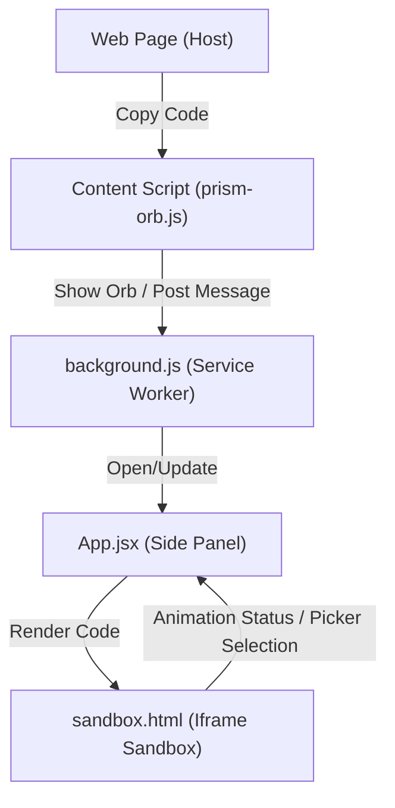

# 🌈 Prism: Technical Architecture & System Overview

**Prism** is a Chrome Extension designed to provide instant previews and AI-driven annotations for code snippets (HTML, React, Vue) directly in the browser's side panel. It acts as a bridge between "copied code on the web" and "AI-assisted development".

---

## 🏗️ System Architecture

Prism follows a distributed architecture involving the host web page, a background service worker, and a sandboxed side panel.



### 1. The Host Layer (Content Scripts)
- **`content/spy.js`**: Injects logic into the page to listen for internal clipboard events that standard listeners might miss.
- **`content/prism-orb.js`**: Detects copy gestures, analyzes the code (kind, theme), and displays a "Refract" Orb (HUD) to send code to Prism.
- **`content/prism-orb.css`**: Styling for the Orb HUD.

### 2. The Communication Layer (Background)
- **`background.js`**: Orchestrates state between the content scripts and the side panel. It handles opening the side panel and routing `PRISM_RENDER_NOW` messages.

### 3. The Visualization Layer (Side Panel)
- **`sidepanel/src/App.jsx`**: Reactive state manager. Handles history, rendering snapshots, instruction state, and coordination with the sandbox.
- **`sidepanel/sandbox.html`**: The execution core. It runs in a separate process to safely render user-provided HTML/JS. It includes:
    - **Transpiler**: Uses Babel to convert React/Modern JS into browser-runnable code.
    - **Motion Freeze**: Logic to pause/resume CSS animations.
    - **Picker Engine**: Uses `elementsFromPoint` to accurately detect elements (even those with `pointer-events: none`).

---

## 📁 File Structure

```text
Prism/
├── manifest.json           # Extension configuration (MV3)
├── background.js           # Shared event handler
├── content/
│   ├── spy.js              # Injector script
│   ├── prism-orb.js        # Web page interaction & detection
│   └── prism-orb.css       # Orb UI styling
├── sidepanel/
│   ├── sandbox.html        # Core rendering & sandbox engine (CRITICAL)
│   ├── index.html          # Entry for the Side Panel UI
│   └── src/
│       ├── main.jsx        # React bootstrap
│       ├── App.jsx         # Main application logic & state
│       ├── components/
│       │   ├── Header.jsx         # Global actions & Play/Pause controls
│       │   └── FloatingInput.jsx  # AI instruction/memo overlay
│       └── index.css       # Design system & global styles
└── icons/                  # App icons (16, 32, 48, 128)
```

---

## 🛠️ Key Modules & Functions

### `sidepanel/sandbox.html`
- **`detectAnimations()`**: Scans all stylesheets and computed styles to decide if the page has motion.
- **`setFrozen(bool)`**: Pauses all CSS animations/transitions and shows memo markers.
- **`findTargetAt(x, y)`**: High-fidelity picker logic that ignores `pointer-events: none` to find the exact source element.
- **`render(code, language)`**: Transpiles and injects code into the sandbox DOM.

### `sidepanel/src/App.jsx`
- **`handlePickerToggle()`**: Switches the app into element-choosing mode.
- **`memos` state**: Stores all AI instructions mapped to source line numbers.
- **`onExportPrompt()`**: Synthesizes the rendered results and user memos into a prompt for AI agents.

### `sidepanel/src/components/FloatingInput.jsx`
- **`calculatePosition()`**: Dynamically places the memo input box near the picked element, ensuring it stays within the viewer area.

---

## 🎯 Purpose for AI Agents
When working on Prism, an AI agent should focus on the **`App.jsx` <-> `sandbox.html`** bridge for UI/feature changes, and **`prism-orb.js`** for interaction within the user's current browsing session.
